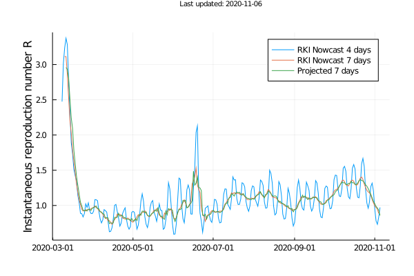
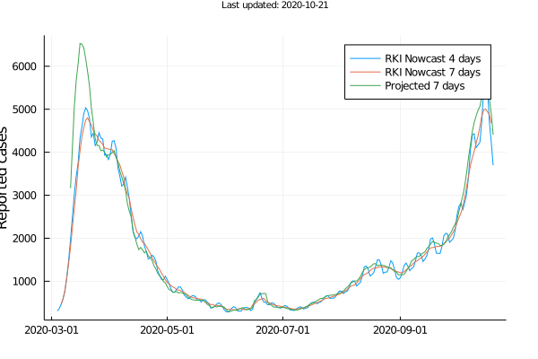
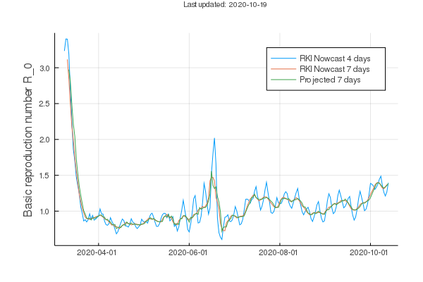
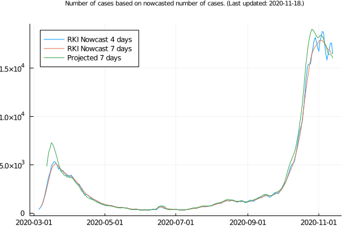

# Point estimators for reproduction number `R`

In the wake of the current pandemic, the reproduction number `R` takes on an important role.
It is defined as the average number of people who get infected by a typical case.
Ideally, we'd like to see `R` drop below 1 so that a pandemic (eventually) fades out.

We compare different point estimators for `R` with respect to their effectiveness in representing historical data.
Specifically, we compare an acausal point estimator that accurately accounts for weekly periodicities to the point estimator that has long been used by the Robert Koch Institut (4-day moving average), and a point estimator that the Robert Koch Institut started using recently (7-day moving average).

The code is based on the medRxiv submission `MEDRXIV/2020/100974`.

The following plot shows three different point estimators, namely:

| Name | Description |
| --- | --- |
| `RKI Nowcast 4 days` | Estimator long used by Robert Koch Institut; effectively a 4-day moving average. |
| `RKI Nowcast 7 days` | Estimator used by Robert Koch Institut; effectively a 7-day moving average, taking 5 days from the past and one day from the future. |
| `Projected 7 days` | Acausal estimator that accounts for three days of the past, the current day, and three days of the future; future values are based on the respective values from the previous week. | 

## Results for reported cases

The data for the reported cases comes from the [daily updated figures](https://www.arcgis.com/sharing/rest/content/items/f10774f1c63e40168479a1feb6c7ca74/data) from the Robert Koch Institut.

The curves for the reproduction number `R` look as follows

The curves for the actual reported cases look as follows

## Results for nowcasted cases

The data for the nowcasted cases comes from the [daily updated figures](https://www.rki.de/DE/Content/InfAZ/N/Neuartiges_Coronavirus/Projekte_RKI/Nowcasting_Zahlen.xlsx\?__blob\=publicationFile) from the Robert Koch Institut.

The curves for the reproduction number `R` for the reported cases look as follows

The curves for the actual reported cases look as follows

