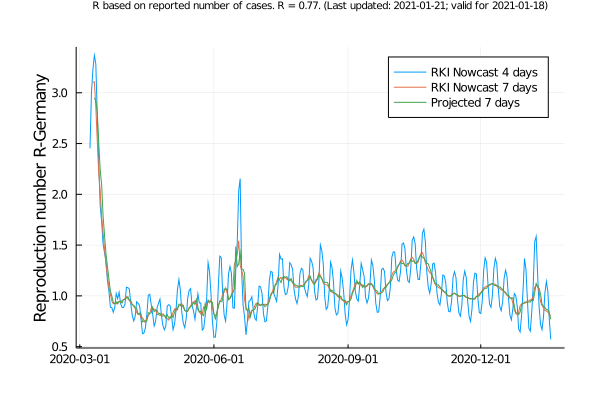
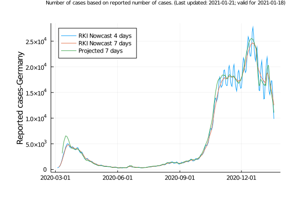
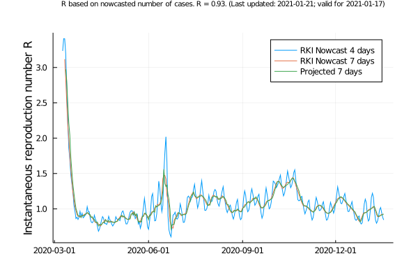
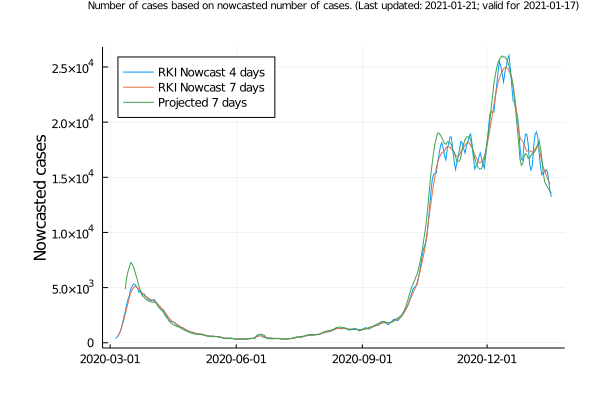

[](https://julialang.org/)
[](https://r-estimator-dashboard.herokuapp.com/)
[](https://www.medrxiv.org/content/10.1101/2020.11.27.20238618v1)


[](https://r-estimator-dashboard.herokuapp.com/)

# Covid-19 in Germany &ndash; Point estimators for `R`



In the wake of the current pandemic, the reproduction number `R` takes on an important role.
It is defined as the average number of people who get infected by a typical case.
Ideally, we'd like to see `R` drop below 1 permanently so that a pandemic (eventually) fades out.

We compare different point estimators for `R` with respect to their effectiveness in representing historical data.
Specifically, we compare an acausal point estimator that accurately accounts for weekly periodicities to the point estimator that has long been used by the Robert Koch Institut (4-day moving average), and a point estimator that the Robert Koch Institut started using recently (7-day moving average).

The code is based on the [this preprint (in German)](https://www.researchgate.net/profile/Ralf_Mikut/publication/341447502_Schatzung_einer_zeitabhangigen_Reproduktionszahl_R_fur_Daten_mit_einer_wochentlichen_Periodizitat_am_Beispiel_von_SARS-CoV-2-Infektionen_und_COVID-19/links/5ec190ee92851c11a870291a/Schaetzung-einer-zeitabhaengigen-Reproduktionszahl-R-fuer-Daten-mit-einer-woechentlichen-Periodizitaet-am-Beispiel-von-SARS-CoV-2-Infektionen-und-COVID-19.pdf), and [this medrXiv preprint](https://www.medrxiv.org/content/10.1101/2020.11.27.20238618v1).

The following plot shows three different point estimators, namely:

| Name | Description |
| --- | --- |
| `RKI Nowcast 4 days` | Estimator long used by Robert Koch Institut; effectively a 4-day moving average. |
| `RKI Nowcast 7 days` | Estimator used by Robert Koch Institut; effectively a 7-day moving average, taking 5 days from the past and one day from the future. |
| `Projected 7 days` | Acausal estimator that accounts for three days of the past, the current day, and three days of the future; future values are based on the respective values from the previous week. | 

## Installation

The code was tested with `Julia 1.5.2`.
You can [add the code to your local machine as an unregistered package](https://julialang.github.io/Pkg.jl/v1/managing-packages/#Adding-unregistered-packages-1) called `ReproductionNumbers`.
Simply switch to the package manager, and add the package locally.
```julia
julia> ]
(@v1.5) pkg> add https://github.com/timueh/COVID-19
julia> using ReproductionNumbers
```

## Getting started

After having installed the package, you can check out the examples in the designated folder.

## Results for reported cases

__The following plots are generated upon calling [`example/reported-germany.jl`](example/reported-germany.jl)__

The data for the reported cases comes from the [daily updated figures](https://www.arcgis.com/sharing/rest/content/items/f10774f1c63e40168479a1feb6c7ca74/data) from the Robert Koch Institut.

The curves for the reproduction number `R` look as follows


The curves for the actual reported cases look as follows


## Results for nowcasted cases

*Unfortunately, the nowcasting data is not accessible via an API, and automated downloads are blocked at some point by a captcha. That's why the nowcasting data may not be up to date.*

__The following plots are generated upon calling [`example/nowcasting.jl`](example/nowcasting.jl)__

The data for the nowcasted cases comes from the [daily updated figures](https://www.rki.de/DE/Content/InfAZ/N/Neuartiges_Coronavirus/Projekte_RKI/Nowcasting_Zahlen.xlsx\?__blob\=publicationFile) from the Robert Koch Institut.

The curves for the reproduction number `R` for the reported cases look as follows



The curves for the actual reported cases look as follows



## Dashboard

[Dashboard for Point estimators for reproduction number `R`.](https://r-estimator-dashboard.herokuapp.com/)

The dashboard is built using Julia.
Unfortunately, the app sometimes fails to connect in time.
Consider re-loading or just running the app locally (for which you need the Julia packages `Dash`, `DashHtmlComponents`, `DashCoreComponents`, `DataFrames`, and `CSV`).

```julia
julia> ; cd app/
julia> include("app.jl")
```

*Based on publicly available data from the German Robert Koch Institut.*